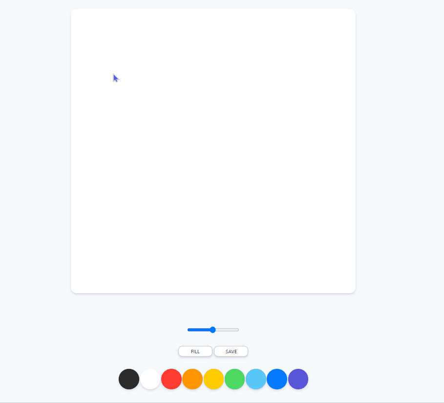

# painting App by JS 🎨

<strong>For Practice JS</strong>
- CanvasRenderingContext2D 
- eventListener 
- DOM Object
- etc.

<h2>Example</h2>
  

<h2>REF.</h2>
<a href="https://nomadcoders.co"> NOMAD CODERS </a>

